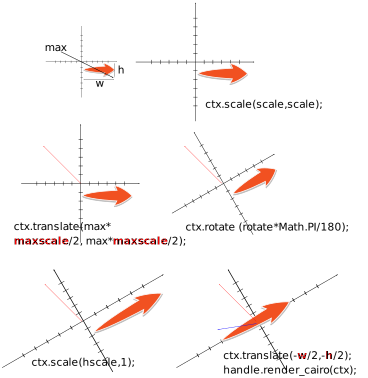

# cairo画图过程分析

## 概念性的通俗说明

使用 Cairo 绘图，首先需要创建 `Surface`，绘图的表面。比如在 png / svg / pdf / GtkDrawable（控件） 等界面。相当于墙壁window，窗帘png，美女海报pdf，可缩放的投影仪svg。

然后要在 Surface 上创建 `Context`，绘图的环境。一般使用 cr/ctx 这样的参数名。环境保存着所有的图形状态参数，这些参数描述了图形的构成。相当于集合工具箱，量尺，三角板，量角器，色彩颜料，以及画图草稿。

还有一个照相机。每次拍照，最后叠加到黑板上，给人看。相当于render渲染的反向过程。