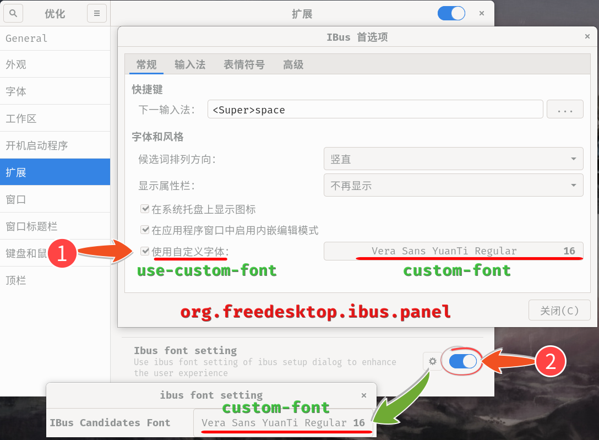

# ibus-rime

##设置模糊音
> ibus的拼音输入法，模糊音一直不正常。试试这个`ibus-rime`。源里面就有。

> 添加输入法的时候，要搜索`rime`，然后选择`汉语（中国）`，否则多半找不到。

> 发现模糊音不好设置，只能搜索。

- 从[Rime 定製指南](https://github.com/rime/home/wiki/CustomizationGuide) 找到 [模糊音定制模板](https://gist.github.com/lotem/2320943)。

- 文件保存到 `~/.config/ibus/rime/luna_pinyin_simp.custom.yaml`，注意的是文件名要对应`simp`简体输入，也就是当前使用的输入法。

- 启用文件内需要的设置行。然后在状态栏点击一下`部署`。部署，经常需要切换一下其他输入法，才能执行。
```
    - derive/^([zcs])h/$1/             # zh, ch, sh => z, c, s      <--- 这行会把suai转成shuai。奇怪的逻辑。
    - derive/([aeiou])ng$/$1n/         # an, en, in, on, un => +g      <--- 这行会把yin转成ying。
    - derive/^n/l/                     # n => l
    - derive/^l/n/                     # l => n
```
> 这逻辑，和我以为的正则表达式，是反的，害我改了半天。晕死。不理解。

---

##ibus候选字体

如图，需要两个开关同时有效。其中第二个开关不知道在哪里。rime的yaml文件设置字体无效。被gnome-shell的找不到的css接管了。

