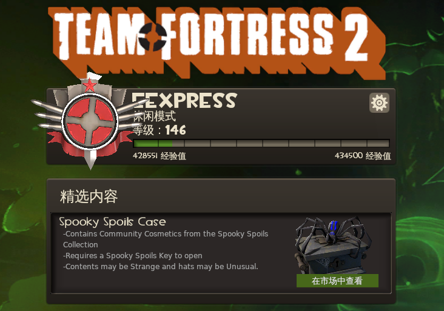

# 游戏疑问

## 中文显示问题

1. Team Fortress 2 

	1. 配置了`~/.config/fontconfig/fonts.conf`，把Arial用园体代替，也不能显示中文。
	1. 安装`wqy-zenhei-fonts`，就可以显示了。为什么。。。。。

1. Hard West 

	1. 有翻译好的tsv汉化文件，还是显示不出来。不知道如何替换字体。win下却可以。总觉得就是字体替换的问题。
	
	
	
## 升级到`F31`后，Nvidia显卡问题

1. steam游戏**属性**里面，以前的`optirun -b primus %command%`的设置就失效了。怎么设置，n卡都废弃了。
1. gog独立游戏，倒是还可以`optirun`跑。

#### 测试帧数
command|card|fps
--|--|--
glxspheres64|Intel|60
primusrun glxspheres64|Nvidia|60
optirun -b primus glxspheres64|Nvidia|60
vblank_mode=0 primusrun glxspheres64|Nvidia|115
optirun glxspheres64|Nvidia|173
optirun -b virtualgl glxspheres64|Nvidia|175
optirun -b auto glxspheres64|Nvidia|175

> 好像是`primusrun`不能超过桌面设置的帧数。只能加`vblank_mode=0`来超越。

#### glxspheres64对于两种显卡的提示
1. OpenGL Renderer: Mesa DRI Intel(R) HD Graphics 630
1. OpenGL Renderer: GeForce GTX 1050 Ti/PCIe/SSE2

