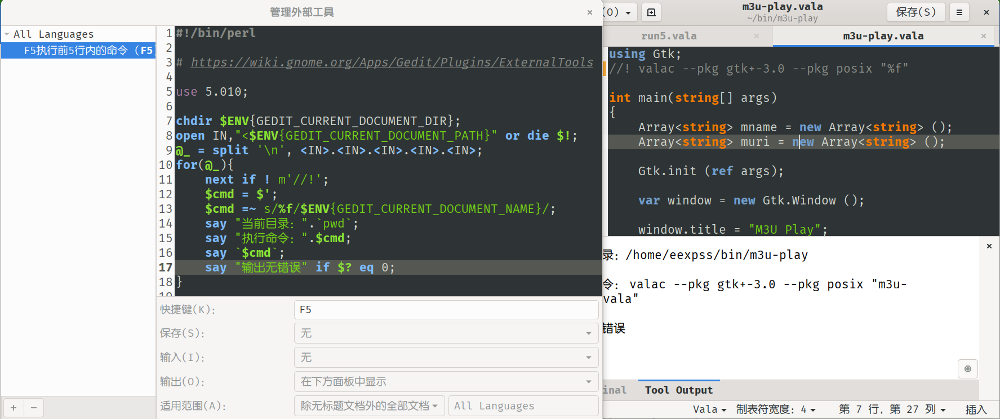

# Gedit

## 安装 gedit-plugins
```
⭕ dnf history |g gedit
   275 | install gedit-plugins    | 2019-11-02 15:32 | Install        |   27
⭕ dnf history info 275
事务 ID： 275
起始时间    ： 2019年11月02日 星期六 15时32分43秒
起始 RPM 数据库     ： 2299:c5e72952386a39e2b021bbd55d0102e6e75e40a7
结束时间       ： 2019年11月02日 星期六 15时32分45秒 （2 秒）
结束 RPM 数据库      : 2326:8e58f0c3e8efadadeb5165eb366b804ffa8f7760
用户           ： eexpss <eexpss>
返回码    ： 成功
Releasever     : 31
命令行   ： install gedit-plugins
已改变的包：
    安装 xapian-core-libs-1.4.13-1.fc31.x86_64               @updates
    安装 dee-1.2.7-25.fc31.x86_64                            @fedora
    安装 gedit-plugin-bookmarks-3.34.0-2.fc31.x86_64         @fedora
    安装 gedit-plugin-bracketcompletion-3.34.0-2.fc31.x86_64 @fedora
    安装 gedit-plugin-charmap-3.34.0-2.fc31.x86_64           @fedora
    安装 gedit-plugin-codecomment-3.34.0-2.fc31.x86_64       @fedora
    安装 gedit-plugin-colorpicker-3.34.0-2.fc31.x86_64       @fedora
    安装 gedit-plugin-colorschemer-3.34.0-2.fc31.x86_64      @fedora
    安装 gedit-plugin-commander-3.34.0-2.fc31.x86_64         @fedora
    安装 gedit-plugin-drawspaces-3.34.0-2.fc31.x86_64        @fedora
    安装 gedit-plugin-findinfiles-3.34.0-2.fc31.x86_64       @fedora
    安装 gedit-plugin-git-3.34.0-2.fc31.x86_64               @fedora
    安装 gedit-plugin-joinlines-3.34.0-2.fc31.x86_64         @fedora
    安装 gedit-plugin-multiedit-3.34.0-2.fc31.x86_64         @fedora
    安装 gedit-plugin-sessionsaver-3.34.0-2.fc31.x86_64      @fedora
    安装 gedit-plugin-smartspaces-3.34.0-2.fc31.x86_64       @fedora
    安装 gedit-plugin-terminal-3.34.0-2.fc31.x86_64          @fedora
    安装 gedit-plugin-textsize-3.34.0-2.fc31.x86_64          @fedora
    安装 gedit-plugin-translate-3.34.0-2.fc31.x86_64         @fedora
    安装 gedit-plugin-wordcompletion-3.34.0-2.fc31.x86_64    @fedora
    安装 gedit-plugin-zeitgeist-3.34.0-2.fc31.x86_64         @fedora
    安装 gedit-plugins-3.34.0-2.fc31.x86_64                  @fedora
    安装 gedit-plugins-data-3.34.0-2.fc31.x86_64             @fedora
    安装 gucharmap-libs-12.0.1-1.fc30.x86_64                 @fedora
    安装 telepathy-glib-0.24.1-14.fc31.x86_64                @fedora
    安装 zeitgeist-1.0.2-1.fc31.x86_64                       @fedora
    安装 zeitgeist-libs-1.0.2-1.fc31.x86_64                  @fedora
```
> 其中，`gedit-plugin-git`可以实时显示与最后一次*git*提交不同的行。

---

## 安装 gedit-plugin-markdown_preview

[github仓库](https://github.com/maoschanz/gedit-plugin-markdown_preview)

> **52k**的插件。需安装`pandoc`，在侧栏，实时生成*markdown*的预览。

---

## 修改颜色主题

- gedit的主题，使用`gtksourceview`的设置。这个是应该统一的规范做法。
- 其实自带颜色主题编辑器。`gedit-plugin-colorschemer`。注意，目前主题的`Name`和`ID`都不能使用中文字符，否则不让保存。
- `⭕ cp /usr/share/gtksourceview-4/styles/oblivion.xml ~/.local/share/gtksourceview-4/styles/eexp.oblivion.xml`
- 发现支持`scale=xx`属性，可放大样式。类似以前的`source insight`。
- 仍然缺少vim配色里面的s///这种分段高亮检测。
- 修改如下。主要是keyword要粗体。

	```
	⭕ diff /usr/share/gtksourceview-4/styles/oblivion.xml ~/.local/share/gtksourceview-4/styles/eexp.oblivion.xml
	24c24
	< <style-scheme id="oblivion" _name="Oblivion" version="1.0">
	---
	> <style-scheme id="eexp.oblivion" _name="eexp.Oblivion" version="1.0">
	39c39
	<   <color name="skyblue1"                    value="#729fcf"/>
	---
	>   <color name="skyblue1"                    value="#7CBBFF"/>
	95c95
	<   <style name="def:identifier"              foreground="skyblue1"/>
	---
	>   <style name="def:identifier"              foreground="skyblue1" bold="true"/>
	98c98
	<   <style name="def:statement"               foreground="white" bold="true"/>
	---
	>   <style name="def:statement"               foreground="skyblue1" bold="true"/>
	```

## 需要的插件功能
- 拆分窗口。旧版失效。
- 代码折叠。[gedit-folding](https://github.com/JacekPliszka/gedit-folding) 勉强可用，太简陋。
- ViGedit 插件已死。
- `geany`那种，可定义工具栏。比如*切换注释*的`Ctrl-(Shift-)M`要看帮助才知道。还有*书签*的`Ctrl-(Alt-)B`。
- `geany`那种生成/执行，调试窗口，目前`Tool Output`的出错信息可以直接跳转到出错行。
- devhelp的插件，F2热键，要直接把*选择的文字*丢给devhelp就好了。
- 自带终端，需要*自动切换目录*的功能。右键菜单的`Change Directory`不支持中文目录。

## 需要增强的
- gedit **同窗口**不能中键粘贴。
- 不方便复制行，要加 vscode 那种 向上向下复制一行： Shift+Alt+Up 或 Shift+Alt+Down
- 不方便查找当前词？查找定义？
- 编译错误，无法反馈跳转。缺少专用的`信息`窗口。
- f2调用`devhelp`，不认选择词。

## line_tools 无效
https://github.com/gmate/gmate/tree/master/plugins/gedit3/line_tools
单独复制出来的line_tools，放到插件目录，热键全无效。其实只是想要复制行。带的切换注释，选择单词/行等，无所谓。

## ctags的浏览插件，侧栏显示。
https://github.com/toobaz/gedit-source-code-browser

## 发现好强大的自带插件，**外部工具**。


[官网说明](https://wiki.gnome.org/Apps/Gedit/Plugins/ExternalTools)，这样根本不需要写复杂的插件了。

```
⭕ l ~/.config/gedit/tools/
行首F4复制行  F5执行前5行内的命令
```
