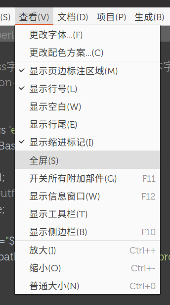

# 编辑器热键

> 以 geany 为基础整理

1. 复制行/文字 `Ctrl-D` 删除行 `Ctrl-K`
2. 移动行 `Alt-UP/DOWN` (gedit) `Alt-PageUp/PageDown` (geany)
3. 删除到行首尾 `Shift-Ctrl-Backspace/Delete`
4. 复制/剪切行 `Shift-Ctrl-C/V`
5. 左右平移 `Ctrl-U/I`
6. 标记和跳转 `Ctrl-M/,/.` 
7. 跳转历史位置 `Alt-Left/Right`
8. 跳转前后单词 `Ctrl-/ \`
9. 切换注释 `Ctrl-E`
10. 缩放文字 `Ctrl- - + 0`
11. 拆分窗口 `Shift-Ctrl-Down/Right`

## 自动补全/折叠/补全

## 切换工具栏
F10 侧栏
F11 全部
F12 信息

